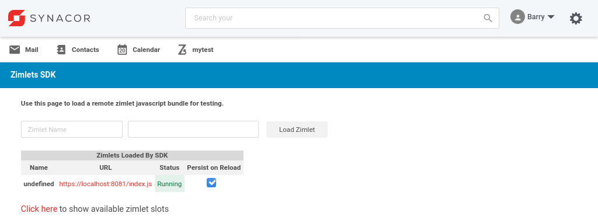
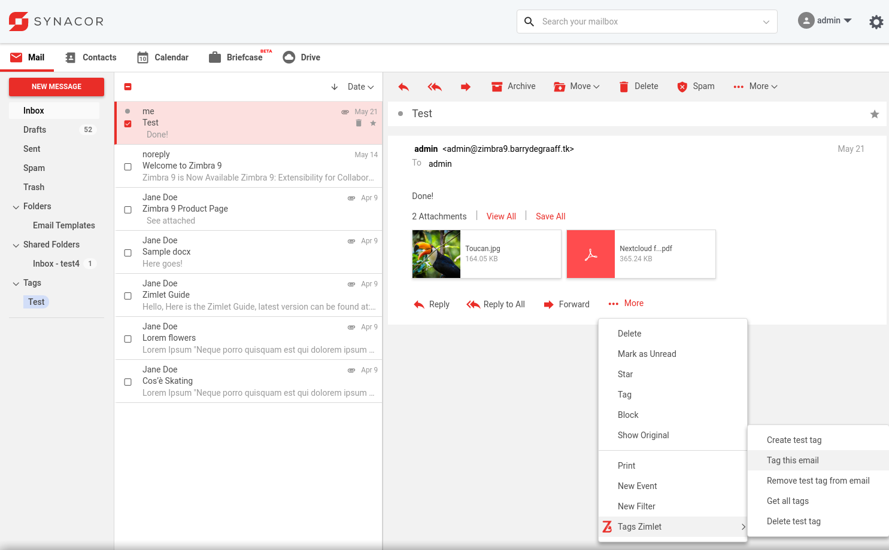
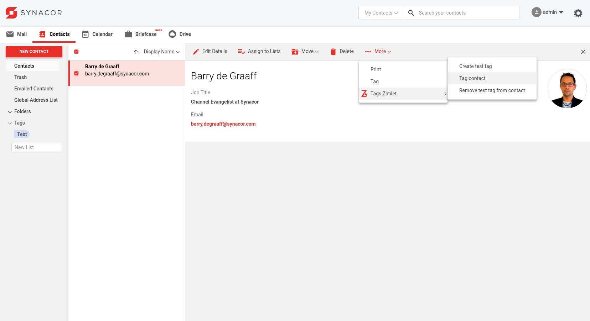
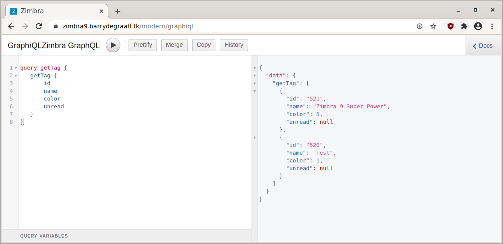
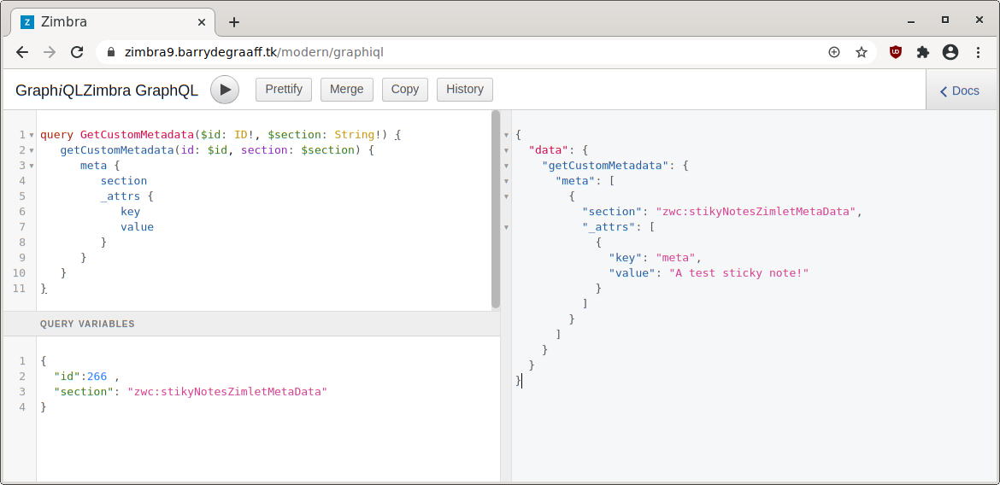
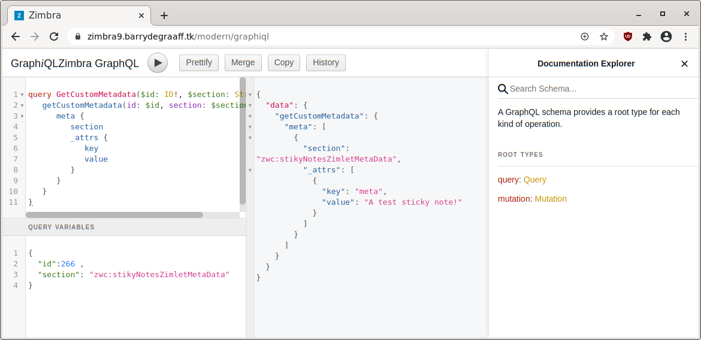
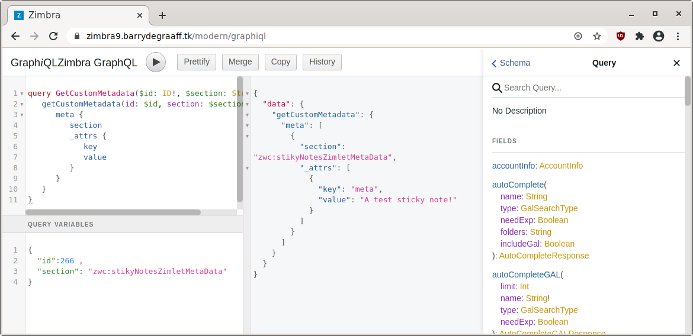

# Using tags and GraphQL from a Zimlet

This article explains how to write a Zimlet to create, modify and delete tags. It also shows how to add and remove tags from emails and contacts in Zimbra. 

Additionally this article shows how to use GraphQL and Apollo Client from a Zimlet. This article assumes you have already set up your development environment, have basic understanding of Preact Zimlets and Zimlet CLI. If you are new to all this, please take a look at https://wiki.zimbra.com/wiki/DevelopersGuide#Zimlet_Development_Guide.

## Downloading and running the Tags Zimlet

Create a folder on your local computer to store the Tags Zimlet:

      mkdir ~/zimbra_course_pt5
      cd ~/zimbra_course_pt5
      git clone https://github.com/Zimbra/zimbra-zimlet-tags
      cd zimbra-zimlet-tags
      npm install
      zimlet watch

The output of this command should be:

```
Compiled successfully!

You can view the application in browser.

Local:            https://localhost:8081/index.js
On Your Network:  https://192.168.1.100:8081/index.js
```

Visit https://localhost:8081/index.js in your browser and accept the self-signed certificate. The index.js is a packed version of the `Tags Zimlet`. More information about the zimlet command, npm and using SSL certificates can be found in https://github.com/Zimbra/zm-zimlet-guide. 

## Sideload the Tags Zimlet

Log on to your Zimbra development server and make sure that you are seeing the modern UI. Then append `/sdk/zimlets` to the URL.

> 
*Sideload the Tags Zimlet by clicking Load Zimlet. The Zimlet is now added to the Zimbra UI in real-time. No reload is necessary.*

> 
*Tags menu added in More... menu in Mail app*

> 
*Tags menu added in More... menu in Contacts app*

## Visual Studio Code

The `Tags` Zimlet is not a real-world example Zimlet. Instead it has pieces of code that can be used as a cookbook reference for working with Tags and GraphQL from Zimlets in Zimbra. To learn from this Zimlet you should open it in Visual Studio Code and take a look at the methods implemented in the `Tags Zimlet` menu.


Open the folder `~/zimbra_course_pt5/zimbra-zimlet-tags` in Visual Studio Code to take a look at the code in the Tags Zimlet. The general structure of the Zimlet and the way menu's are implemented in Zimlet slots has been described in previous guides. Refer to https://wiki.zimbra.com/wiki/DevelopersGuide#Zimlet_Development_Guide.

## Tags menu in the Mail app

The file src/components/more-menu/index.js implements the `Tags Zimlet` sub menu in the `More...` menu in the Mail app. The in-code comments explain how it works:

```javascript
/* https://wiki.zimbra.com/wiki/DevelopersGuide#Zimlet_Development_Guide */
import { createElement, Component } from 'preact';
import { Text, withText } from 'preact-i18n';
import { withIntl } from '../../enhancers';
import { ActionMenuGroup, ActionMenuItem, NestedActionMenuItem } from '@zimbra-client/components';
import { withTagCreate, withActionMutation, withTags, withTagAction } from '@zimbra-client/graphql';
import style from './style';
import { useApolloClient, gql } from '@apollo/client';

// See also: https://files.zimbra.com/docs/soap_api/8.8.8/api-reference/zimbraMail/MsgAction.html

@withIntl()
@withText({
    create: 'tags-zimlet.create',
    title: 'tags-zimlet.title',
    tagEmail: 'tags-zimlet.tagEmail',
    removeEmailTag: 'tags-zimlet.removeEmailTag',
    getAllTags: 'tags-zimlet.getAllTags',
    removeTag: 'tags-zimlet.removeTag',
})
@withTagCreate() //Makes available the `createTag` method, to create tags
@withActionMutation() //Makes available the `action` method, to add a tag to an email
@withTagAction() //Makes available the `tagAction` method, to change existing tags
@withTags({},
    ({ data: { getTag: tags } }) => ({
        tagList: tags
    })
) //Makes available this.props.tagList with a list of current tags when component initializes
export default class MoreMenu extends Component {
    constructor(props) {
        super(props);
        this.zimletContext = props.children.context;
        console.log(this);
    };

    createTag = e => {
        const { createTag } = this.props;
        /*
        0: blue, // default color
        1: blue,
        2: cyan,
        3: green,
        4: purple,
        5: red,
        6: yellow,
        7: pink,
        8: gray,
        9: orange
        */

        const zimlet = this;
        createTag({ name: 'Test', color: 1 }).then(function (result) {
            console.log(result);
            zimlet.alert('Tag created with id:' + result.data.createTag.id);
        }).catch(function (error) {
            console.log(error);
            zimlet.alert('Whoops an error see console.log');
        });
    }

    tagEmail = e => {
                //this.props.emailData contains a JSON-like object with the clicked email's data, the id is used to perform actions on the mail item.
        const { action } = this.props;
        const zimlet = this;
        return action({
            ids: [this.props.emailData.id], //supports multiple items using: ["1000", "1001"]
            op: "tag",
            tagNames: "Test",
            tagToAdd: {
                name: "Test"
            },
            tagToRemove: false,
            removeFromList: false,
            idsToRemove: [],
            type: "MsgAction",
            view: "MsgAction"
        }).then(() => {
            //You can do more stuff here
        });
    }

    /*`removeFromList`: Boolean - If user is exploring "Tag 1" list and he/she removes "Tag 1" from list, 
    removeFromList will make sure to remove item from current list by optimistic update.*/
    removeEmailTag = e => {
        const { action } = this.props;
        const zimlet = this;
        return action({
            ids: [this.props.emailData.id],
            op: "!tag", // Notice `!` before `tag`
            tagNames: "Test",
            tagToAdd: false,
            tagToRemove: {
                name: "Test"
            },
            removeFromList: false, // See description above
            idsToRemove: [],
            type: "MsgAction",
            view: "MsgAction",
        }).then(() => {
            //You can do more stuff here
        });
    }

    /* Zimbra has an interactive GraphQL client, append /graphiql to the Zimbra server domain to run queries
    use the part between `` from below query 
    
    The getAllTags method shows you how to run any query whenever you want (aka not from render or when the component initializes)
    */
    getAllTags = e => {
        const getTags = gql`
        query getTag {
            getTag {
                id
                name
                color
                unread
            }
        }`;
        //https://www.apollographql.com/docs/react/api/react-hooks/#useapolloclient
        const client = this.zimletContext.getApolloClient();

        //https://www.freecodecamp.org/news/react-apollo-client-2020-cheatsheet/#usingtheclientdirectly
        client.query({
            query: getTags
        })
            .then((response) => {
                console.log(response.data)
            })
            .catch((err) => console.error(err));

        /* In case your query has variables use them like so: 
        client.query({
            query: GET_POSTS,
            variables: { limit: 5 },
        })
        */
    }

    deleteTag = e => {
        const { tagAction, tagList } = this.props;
        /* tagList in an array of objects. Each object contains the data of a tag
        We can use `find` which is an es6 feature to select the tag object with the property name='Test'
        then we can directly get the id of the tag, needed for the tagAction method.*/
        console.log(tagList.find(x => x.name === 'Test').id);
        const tagId = tagList.find(x => x.name === 'Test').id;
        tagAction({ id: tagId }, 'delete')

        //You can also rename or change color of a tag using:
        //tagAction({ id:tagId, name: tagName, color: tagColor }, 'rename')
        //tagAction({ id:tagId, name: tagName, color: tagColor }, 'color')
    }

    /* Method to display a toaster to the user */
    alert = (message) => {
        const { dispatch } = this.zimletContext.store;
        dispatch(this.zimletContext.zimletRedux.actions.notifications.notify({
            message: message
        }));
    }

    render() {
        const childIcon = (
            <span class={style.appIcon}>
            </span>);

        return (
            <div>
                <NestedActionMenuItem
                    anchor="bottom"
                    icon={childIcon}
                    position="right"
                    title={this.props.title}
                >
                    <ActionMenuGroup>
                        <ActionMenuItem onClick={() => this.createTag()}>
                            <Text id="tags-zimlet.create" />
                        </ActionMenuItem>
                        <ActionMenuItem onClick={() => this.tagEmail()}>
                            <Text id="tags-zimlet.tagEmail" />
                        </ActionMenuItem>
                        <ActionMenuItem onClick={() => this.removeEmailTag()}>
                            <Text id="tags-zimlet.removeEmailTag" />
                        </ActionMenuItem>
                        <ActionMenuItem onClick={() => this.getAllTags()}>
                            <Text id="tags-zimlet.getAllTags" />
                        </ActionMenuItem>
                        <ActionMenuItem onClick={() => this.deleteTag()}>
                            <Text id="tags-zimlet.deleteTag" />
                        </ActionMenuItem>
                    </ActionMenuGroup>
                </NestedActionMenuItem>
            </div>
        );
    }
}
```

## Tags menu in the Contacts app

The file src/components/more-menu-contacts/index.js implements the `Tags Zimlet` sub menu in the `More...` menu in the Contacts app. It works quite similar as in the Mail app. But there are some differences in decorator and prop names. The in-code comments explain how it works:

```javascript
/* https://wiki.zimbra.com/wiki/DevelopersGuide#Zimlet_Development_Guide */
import { createElement, Component } from 'preact';
import { Text, withText } from 'preact-i18n';
import { withIntl } from '../../enhancers';
import { ActionMenuGroup, ActionMenuItem, NestedActionMenuItem } from '@zimbra-client/components';
import { withTagCreate, withContactAction } from '@zimbra-client/graphql';
import style from './style';

@withIntl()
@withText({
    create: 'tags-zimlet.create',
    title: 'tags-zimlet.title',
    tagEmail: 'tags-zimlet.tagEmail',
    removeEmailTag: 'tags-zimlet.removeEmailTag',
    getAllTags: 'tags-zimlet.getAllTags',
    removeTag: 'tags-zimlet.removeTag',
    tagContact: 'tags-zimlet.tagContact',
    removeContactTag: 'tags-zimlet.removeContactTag',
})
@withTagCreate() //Makes available the `createTag` method, to create tags
@withContactAction() //Makes available the `contactAction` to add tags to contacts
export default class MoreMenuContacts extends Component {
    constructor(props) {
        super(props);
        this.zimletContext = props.children.context;
        console.log(this);

    };

    createTag = e => {        
        const { createTag } = this.props;
        /*
        0: blue, // default color
        1: blue,
        2: cyan,
        3: green,
        4: purple,
        5: red,
        6: yellow,
        7: pink,
        8: gray,
        9: orange
        */

        const zimlet = this;
        createTag({ name: 'Test', color: 1 }).then(function (result) {
            console.log(result);
            zimlet.alert('Tag created with id:' + result.data.createTag.id);
        }).catch(function (error) {
            console.log(error);
            zimlet.alert('Whoops an error see console.log');
        });
    }

    tagContact = e => {
        //this.props.selectedContacts contains an array with JSON-like objects that contain the selected contacts, the id is used to perform actions on the contact(s) item.
        const { contactAction } = this.props;
        const zimlet = this;
        return contactAction({
            ids: [this.props.selectedContacts[0].id], //supports multiple items using: ["1000", "1001"]
            op: "tag",
            tagNames: "Test",
            tagToAdd: {
                name: "Test"
            },
            tagToRemove: false,
            removeFromList: false,
            idsToRemove: [],
            type: "MsgAction",
            view: "MsgAction"
        }).then(() => {
            //You can do more stuff here
        });
    }

    /*`removeFromList`: Boolean - If user is exploring "Tag 1" list and he/she removes "Tag 1" from list, 
    removeFromList will make sure to remove item from current list by optimistic update.*/
    removeContactTag = e => {
        const { contactAction } = this.props;
        const zimlet = this;
        return contactAction({
            ids: [this.props.selectedContacts[0].id],
            op: "!tag", // Notice `!` before `tag`
            tagNames: "Test",
            tagToAdd: false,
            tagToRemove: {
                name: "Test"
            },
            removeFromList: false, // See description above
            idsToRemove: [],
            type: "MsgAction",
            view: "MsgAction",
        }).then(() => {
            //You can do more stuff here
        });
    }

    /* Method to display a toaster to the user */
    alert = (message) => {
        const { dispatch } = this.zimletContext.store;
        dispatch(this.zimletContext.zimletRedux.actions.notifications.notify({
            message: message
        }));
    }

    render() {
        const childIcon = (
            <span class={style.appIcon}>
            </span>);

        return (
            <div>
                <NestedActionMenuItem
                    anchor="bottom"
                    icon={childIcon}
                    position="right"
                    title={this.props.title}
                >
                    <ActionMenuGroup>
                        <ActionMenuItem onClick={() => this.createTag()}>
                            <Text id="tags-zimlet.create" />
                        </ActionMenuItem>
                        <ActionMenuItem onClick={() => this.tagContact()}>
                            <Text id="tags-zimlet.tagContact" />
                        </ActionMenuItem>
                        <ActionMenuItem onClick={() => this.removeContactTag()}>
                            <Text id="tags-zimlet.removeContactTag" />
                        </ActionMenuItem>
                    </ActionMenuGroup>
                </NestedActionMenuItem>
            </div>
        );
    }
}
```

## New Zimlet slot `action-menu-contacts-more`

New Zimlet slot `action-menu-contacts-more` has been added to the `More...` menu in the Contacts app to add menu items to this menu. Suggested components to implement new menu items are `<ActionMenuItem>` and/or `<NestedActionMenuItem>`.

The `action-menu-contacts-more` passes on to the Zimlet props the selectedContacts variable which contains an array with JSON-like objects that contain the selected contacts. You can get the id to perform actions on the contact(s) item. Example to get the first selected contact id: `this.props.selectedContacts[0].id`.

## Interactive GraphQL client GraphiQL

Zimbra has a built-in GraphQL web client that can be used to interactively run GraphQL queries. This is useful if you want to do a GraphQL query that is not available via a Zimbra shim or decorator. To access it append `/graphiql` to the URL of the Zimbra server.

Example query to get all tags of the current user:

```javascript
query getTag {
   getTag {
       id
       name
       color
       unread
   }
}

```
> 
*getTag query*

You can also run queries and set variables:

```javascript
query GetCustomMetadata($id: ID!, $section: String!) {
   getCustomMetadata(id: $id, section: $section) {
      meta {
         section
         _attrs {
            key
            value
         }
      }
   }
}

//query variables

{ "id": 266, "section": "zwc:stikyNotesZimletMetaData"}
```
> 
*getCustomMetadata query with variables*

## Zimbra GraphQL reference

Zimbra has a built-in GraphQL reference that shows you available queries and mutations. Where a query only returns data a mutation also alters data on the back-end. To access the reference click the `Docs` button on the right top in the GraphiQL client.

> 
*Built-in GraphQL reference*

> 
*Built-in GraphQL reference*

## Note on promises

In this article and demo Zimlet you may have noticed the use JavaScript promises, `.then` and `.catch` like so:

```javascript
   client.query({
      query: getTags
   }).then((response) => {
      console.log(response.data)
   }).catch((err) => console.error(err));
```

If you are not familiar with promises take a look at these articles:

- https://developer.mozilla.org/en-US/docs/Web/JavaScript/Guide/Using_promises
- https://developer.mozilla.org/en-US/docs/Web/JavaScript/Reference/Global_Objects/Promise
